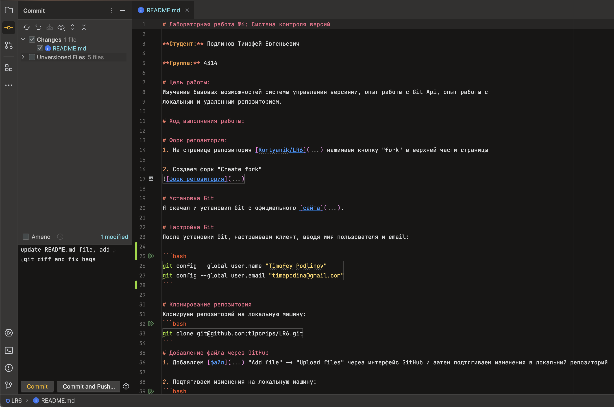
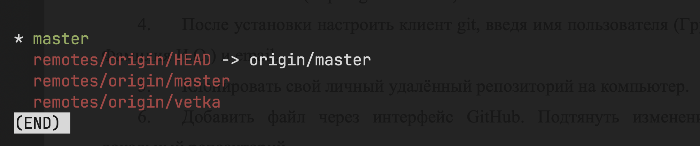
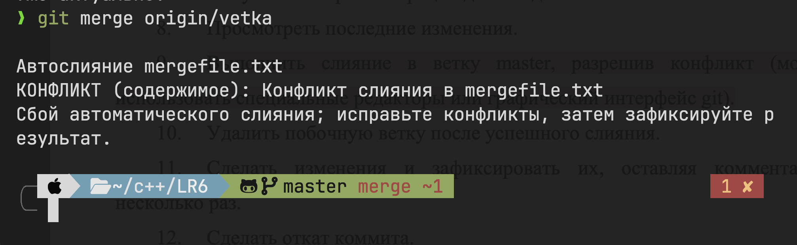
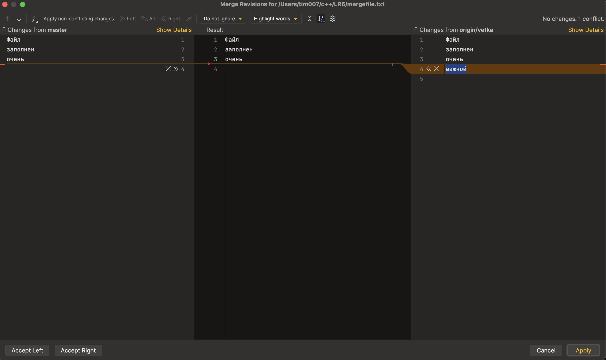
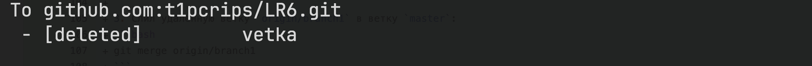

# Лабораторная работа №6: Система контроля версий

**Студент:** Подлинов Тимофей Евгеньевич

**Группа:** 4314

# Цель работы:
Изучение базовых возможностей системы управления версиями, опыт работы с Git Api, опыт работы с 
локальным и удаленным репозиторием.

# Ход выполнения работы:

# Форк репозитория:
1. На странице репозитория [Kurtyanik/LR6](https://github.com/Kurtyanik/LR6) нажимаем кнопку "fork" в верхней части страницы

2. Создаем форк "Create fork"


# Установка Git
Я скачал и установил Git с официального [сайта](git-scm.com).

# Настройка Git
После установки Git, настраиваем клиент, вводя имя пользователя и email:

```bash
git config --global user.name "Timofey Podlinov"
git config --global user.email "timapodina@gmail.com"
```

# Клонирование репозитория
Клонируем репозиторий на локальную машину:
```bash
git clone git@github.com:t1pcrips/LR6.git
```
# Добавление файла через GitHub
1. Добавляем [файл](assets/create_fork.png) "Add file" -> "Upload files" через интерфейс GitHub и затем подтягиваем изменения в локальный репозиторий

2. Подтягиваем изменения на локальную машину:
```bash
git pull
```

# Получение истории операций
Получаем историю операций для каждой из веток:

```bash
git log --all --oneline
```


```bash
git log -all --graph
```


# Просмотр последних изменений
```bash
git diff
```


# Создание коммита через редактор - Goland
В Goland для создания коммита выбираем измененные файлы, пишем сообщение коммита и подтверждаем изменения.



# Слияние веток
Выполняем слияние в ветку master, разрешая конфликт с помощью графического интерфейса Git.
1. Выводим список веток:
```bash
git branch -a
```


2. Слияние удаленной ветки `origin/vetka` в ветку `master`:
```bash
git merge origin/vetka
```


3. Решение конфликта 


# Удаление побочной ветки
После успешного слияния, удаляем побочную ветку:
```bash
git push origin --delete vetka
```

